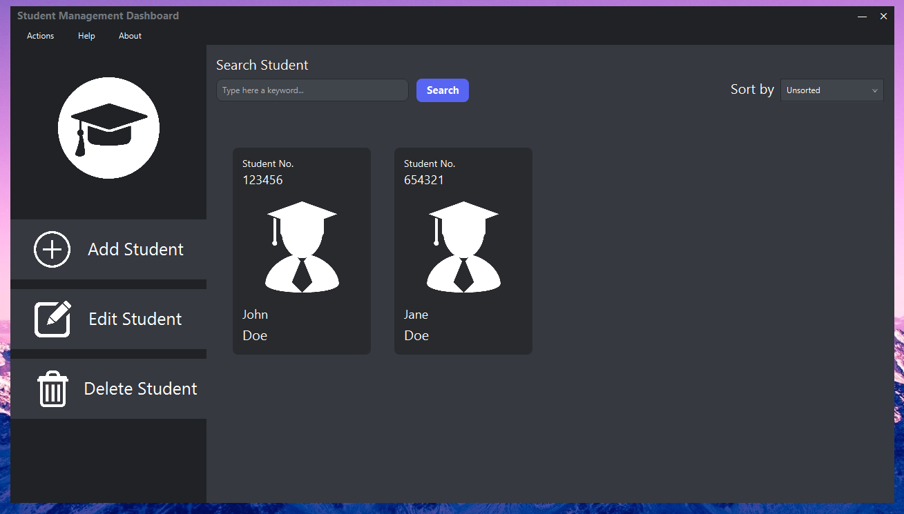

# Student Management Dashboard - MySQL
This is just a slightly improved version of our final project, using MySQL as the database, instead of BufferedStreams.

If you want to check out the original, you can find it on my `Repositories` or [click here](https://github.com/laazyCmd/student-management-dashboard).

# Screenshots

